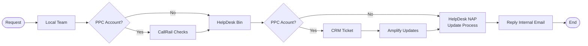

# NAP Updates

We should follow the NAP protocol when we receive an update request involving any change in the Firm Name, Address or Phone Numbers.

For every NAP change, we need to update all properties involved, such as Websites, Blogs, CRM accounts, Facebook, Twitter, LinkedIn, GMB listing, YouTube channel, Accounting records, JLD, PPC landing pages, LSA and any other listings or records managed by Justia.

## General Process

1. **Is amendment needed?** Daniel Lopez will check if an amendment is needed **before** making any changes (for Firm name updates, firm splits or mergers).
    * If an amendment is needed, he will follow up with the client.
      * When things are settled, Daniel will create/reassign a HD ticket to continue the process in step 2.
    * If no amendment is needed, proceed with the following step.
